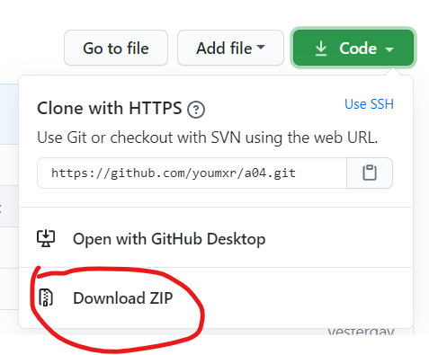
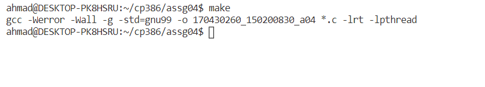
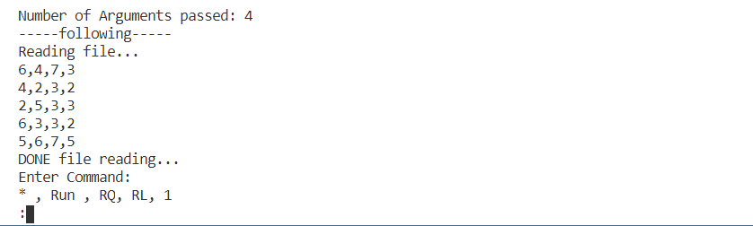

# A04
## **CP386 Assignment 4**

### **PROJECT TITLE: _CP386 A04 DeadLock Avoidance_**

## **MOTIVATION:**

Throughout the course, we learned a lot about operating systems. In this assignment, we are being tested on our ability to practice the concept of deadlock avoidance

## **INSTALLATION:**

-----
**Step 1**: Make sure your environment has C99 language installed and ready to go
if you don't have it install please go to the following link to install C99 on your system
[[Linux](https://tinyurl.com/linuxC99),
[MacOS](https://tinyurl.com/macOSc99),
[Windows](https://tinyurl.com/windowsonly)]

**Step 2**: Install the following project from our github.
[link](https://github.com/youmxr/a04)

**Step 2.2**:  To install it from Github please click on the green button that has "Code" written on it.
 

 
 

**Step 2.3**: Once you click it a drop-down menu should appear. on that menu please click "Download zip".save the file on your system where you can find it 
 

 

**Step 2.4**:
unzip the folder. In the folder you will have
- 170430260_150200830_a04.c (the source code)
- README.md (this file )
- sample4_in.txt (sample input for the code)
- Makefile (used to build the program)
- Screenshots (used for the readme)

**Step 3.1**:
with your IDE or text editor of choice, open the folder
containing the project. in the terminal type ***mv makefile.mk Makefile***

in the terminal type "make" 
you should see this output
 
    
  

**Step 3.2**
In the termnal type the following line, 
**./170430260_150200830_a04.c 10 10 10 10**

**Step 3.3** 
The code should be working with no errors and you will be seeing the implementation of the deadlock avoidance by using the banker's algorithm and safety sequences 

**Step 3.4**
Enter one of the following commands to test the program 
 
- __*:__    Provides information on the allocated resources, needed resources and the avilable resources
- __Run:__  Determins and runs the safe sequence 
- __RQ:__   Request resources
- __RL:__   Releases Resources 
- __1:__    Exit the program 
 

## **FUNCTIONS**

### **&nbsp;&nbsp; UMAR FUNCTIONS:**
- _reqRes_
- _relRes_
- _saftyAlgorthim_
- _threadRun_

### **&nbsp;&nbsp; AHMAD FUNCTIONS:**
-  _userInput_
- _outputValues_
- _Main_
- _documentation_ 

## **TESTS**
EX: ./170430260_150200830 10 10 10 10

      0 10 10

      Number of Arguments passed: 4
      -----following-----
      Reading file...
      6,4,7,3
      4,2,3,2
      2,5,3,3
      6,3,3,2
      5,6,7,5
      DONE file reading...
      Enter Command: 
      * , Run , RQ, RL, 1

## **CODE EXAMPLE**
*: Provides information on the allocated resources, needed resources and the avilable resources
Run:  Determins and runs the safe sequence 
## **AUTHORS**

*Umar Ali & Ahmad Salaymeh*

## **CREDITS**
Umar Ali, Contributer

Ahmad Salaymeh  Contributer

Linux Manual [https://linux.die.net/man/]

## **LICENCES**

***This project is licensed to the authors and is not open source, any use of this code that is not authorized such distribution to others, claiming it as your own or anything that is considered plagiarism will be notified and brought to court. This Project is under protection by the Copyright Act of Canada***
